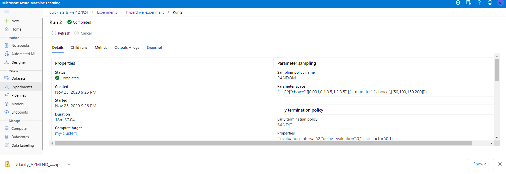
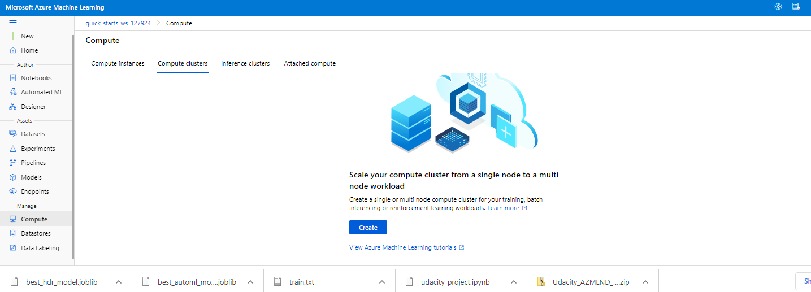

# Optimizing an ML Pipeline in Azure

## Overview
This project is part of the Udacity Azure ML Nanodegree.
In this project, we build and optimize an Azure ML pipeline using the Python SDK and a provided Scikit-learn Logistic Regression model.
This model is then compared to an Azure AutoML run.

The diagram below shows the main steps of creating and optimizing an ML pipeline :

## Summary
The <a href="https://automlsamplenotebookdata.blob.core.windows.net/automl-sample-notebook-data/bankmarketing_train.csv">dataset</a> used in this project is related to direct marketing campaigns of a banking institution, which were based on phone calls. The purpose here is to produce the best model to predict if the client will subscribe (yes/no) a term deposit (target variable "y"). This will go a long way to improve future marketing campaigns for the bank as it will predict the likelihood of a client to subscibe to a product that is being adverstised.

We create and optimize the hyperparameters of a standard Scikit-learn Logistic Regression using **HyperDrive**. We also use **AutoML** to build and optimize a model on the same dataset, so that we can compare the results of the two methods.

We performed 20 runs to find the best hyperparameters using HyperDrive and the highest reported accuracy was **90.72%**. Similarly, we reached 55 iterations using the AutoML and the best performing model was **Voting Ensemble**, which achieved an accuracy of **91.77%**.

## Scikit-learn Pipeline
The pipeline architecture consists of optimizing (tuning) the hyperparameters of a logistic regression binary classification model using HyperDrive. We start by setting up a training script **'train.py'**, were we create a dataset, train and evaluate a logistic regression model from Scikit-learn. Then, we use Jupyter Notebook and Azure ML Python SDK to get the workspace and experiment objects running, and build the training pipeline - from creating a computer cluster, to HyperDrive, to runnning the 'train.py'.

We use two of the most important hyperparameters of Sklearn Logistic Regression : 
* **--C** (float, default: 1.0) – Inverse of regularization strength; must be a positive float; smaller values specify stronger regularization.
* **--max_iter** (int, default: 100) – Maximum number of iterations taken for the solvers to converge.

We use **RandomParameterSampling** method over the hyperparameter search space to randomly select values for C (uniform distribution **0.5, 5.0**) and max_iter (choice among discrete values **50, 100, 150, 200**) hyperparameters. Random sampling supports both discrete and continuous hyperparameters and allows us to refine the search space to improve results.

We also use **BanditPolicy** which defines an early termination policy based on **slack_factor=0.1**, and **evaluation_interval=2**. The slack_factor is the ratio used to calculate the allowed distance from the best performing experiment run. The evaluation_interval is the frequency for applying the policy.

## AutoML
**In 1-2 sentences, describe the model and hyperparameters generated by AutoML.**

## Pipeline comparison
**Compare the two models and their performance. What are the differences in accuracy? In architecture? If there was a difference, why do you think there was one?**
Although the performance of AutoML (Voting Ensemble) was slightly better than HyperDrive, it didn't demonstrate a significant improvement (**1.05%**).

## Future work
**What are some areas of improvement for future experiments? Why might these improvements help the model?**

## Proof of cluster clean up
Before closing the experiment, we cleaned up the resources we used on Azure cloud.

